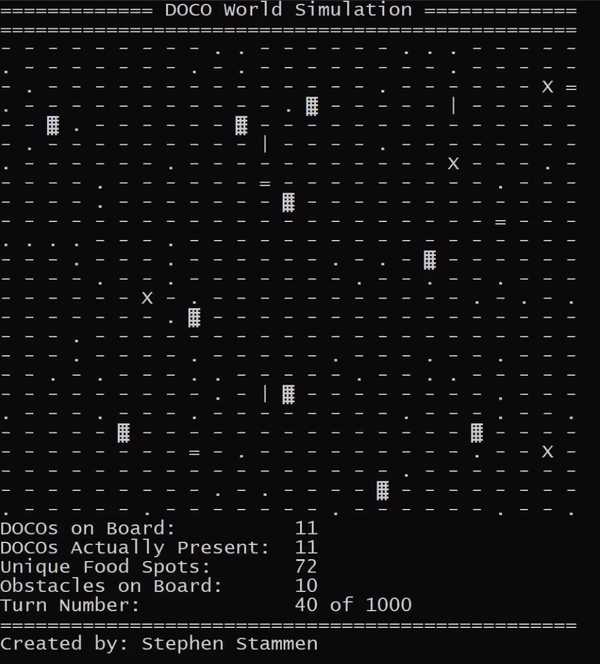
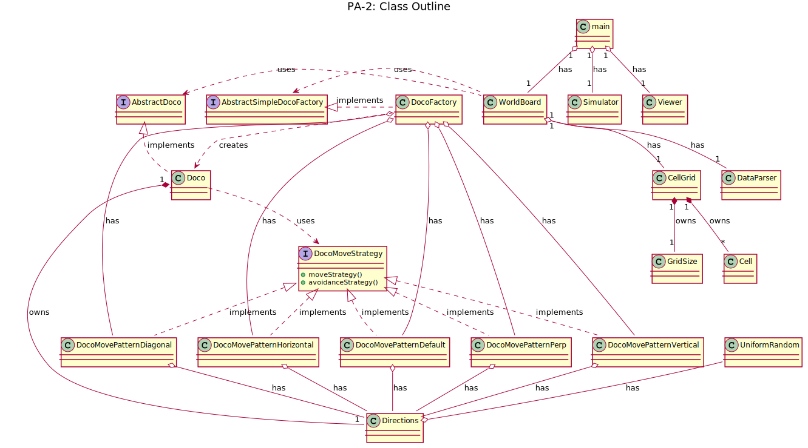
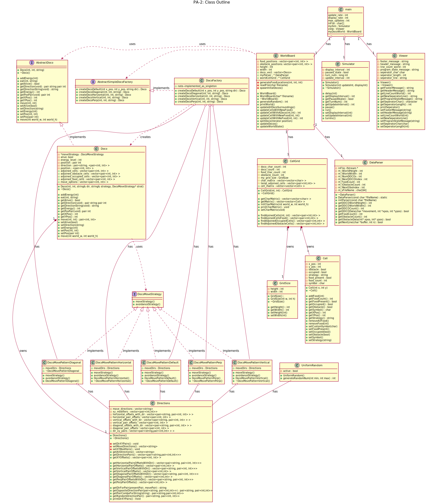

# CS-307-DOCO-SIM-Semester-Project

## Task Overview

- This is a semester long project where we deliver a simulation program, then deliver a version with new contraints and design pattern requirements, and then add a GUI at the end.

## Program Overview - Digital One Celled Organism (DOCO) Simulation

### Summary

- This is a console program that will run a simulation of a world where single celled organisms are spawned in. 
- They will run around eating the food nearby and avoiding walking past the edge of the world. 
- They will avoid walking into each other too. 
- They now also avoid running into obstacles. 
- Additionally, strategy pattern and factory pattern have been implemented to allow for different types of DOCOs. 
- The initial world specifications (height, width, DOCO’s and positions, and food locations) will be read in from a provided file in XML format. 
- As part of version two, the DOCO strategy is also read in. There are a lot of details involved and they are specified below.

### Output

#### Class Outline UML - Preliminary 

#### Class Outline UML - Detailed

